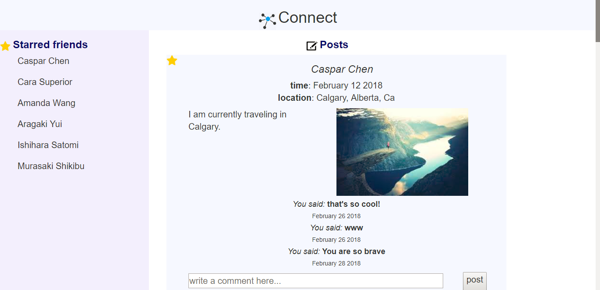
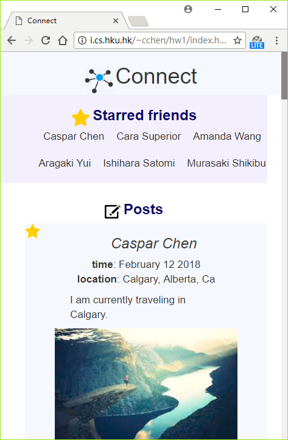

# Connect
A SNS similar to facebook. Developed using technologies learned in class for creating dynamic web pages, i.e., PHP, JavaScript and AJAX. The social network application implements a few simplified functionalities, including displaying posts from friends, replying to posts from friends, and staring your friends into a “starred friends” list. 

- A screenshot of this interface

- A screenshot when the browser is very small

